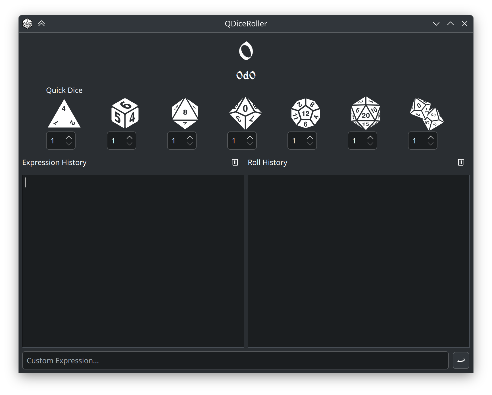
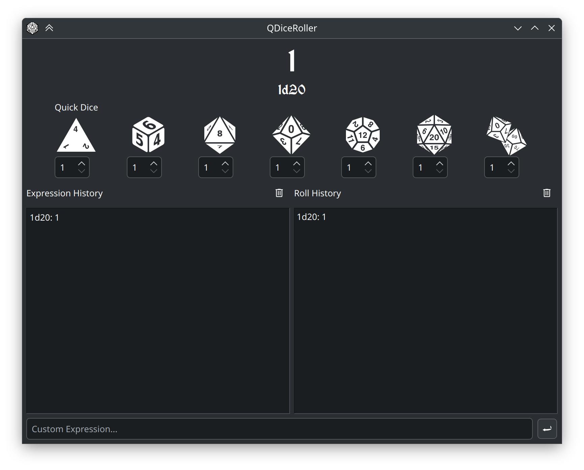
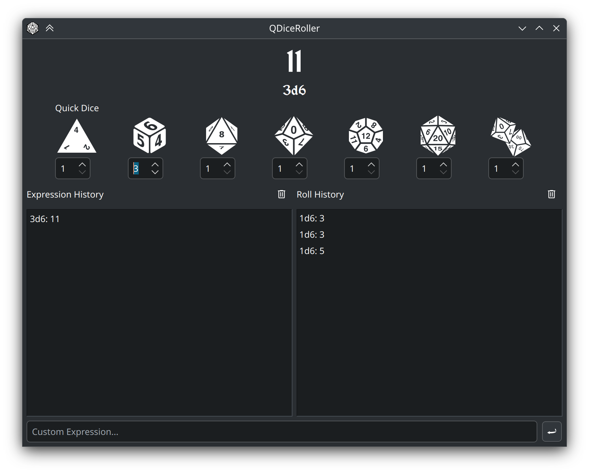
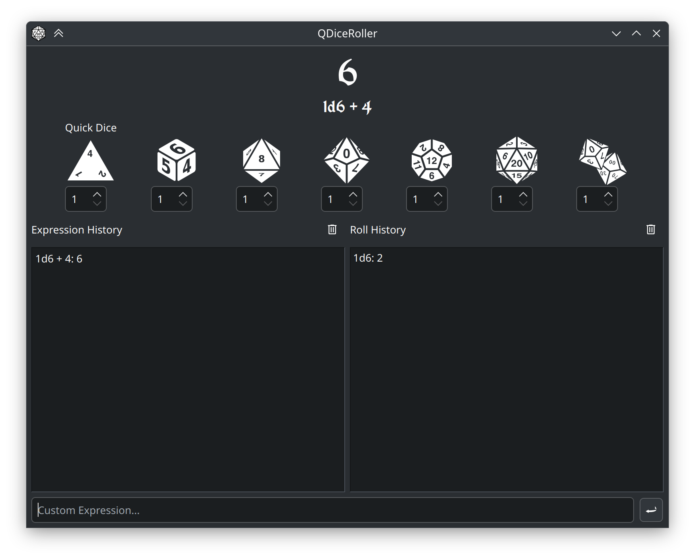
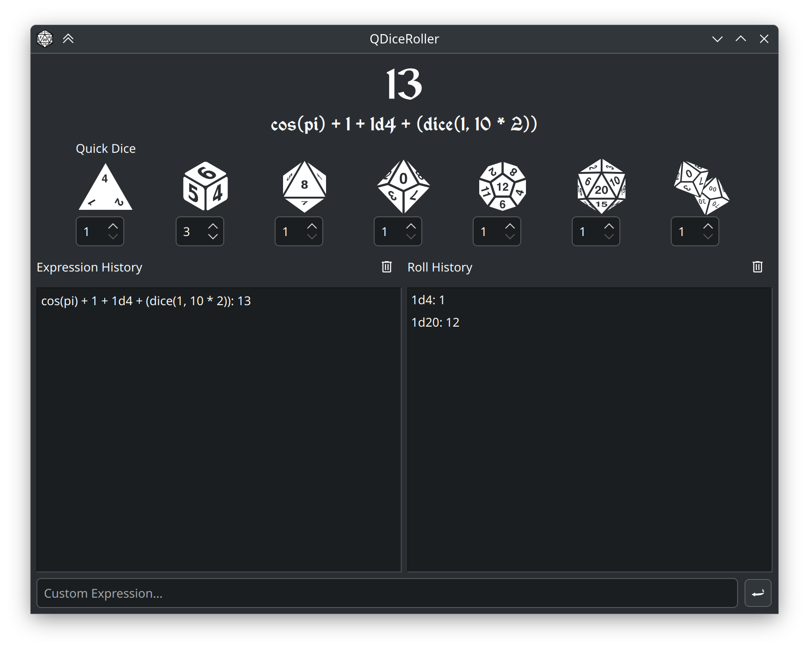

# QDiceRoller
An advanced rpg dice rolling program using Qt


## Roll Dice with Style

QDiceRoller is an advanced dice rolling application that can parse complicated dice rolls.

It uses the ExprTk math library with somewhat hack-y extensions to it so it will support dice notation.



## Install

Currently, only Windows and Arch Linux are officially supported.

### Windows

To install on Windows, go to the Releases tab and find the most recent version of Win32_64 Portable OR Installer Release. The Installer Release is currently planned but not yet available. Simply drop the portable version of QDiceRoller anywhere and run QDiceRoller.exe to start. If you get error messages about missing .DLL files, simply run the bundled vc_redist.x64.exe.

### Linux

Install the package from your distro's package manager if it's supported, otherwise build it from source.

| Distro | Package Name |
| ------ | ------------ |
| Arch<sup>AUR</sup>| qdiceroller-git |

### Build from Source

To build the package from source, you need git, GNU make, and qmake6. If you are running on Windows, you may need MSVC instead, depending on what kind of makefiles qmake generates. If you are using MSVC instead of MinGW, you will need to use nmake, otherwise use MinGW Make as normal described here.

First, download the source code:

```
git clone https://github.com/ganelonhb/QDiceRoller
```

Enter the QDiceRoller directory, then make a new build dir:

```
cd QDiceRoller
mkdir build
cd build
```

Generate the Makefiles with qmake6. Use the "release" build target:

```
qmake6 CONFIG+=release ../
```

Lastly, compile the application:

```
make
```

Here is the entire build process in one go

```
git clone https://github.com/ganelonhb/QDiceRoller
cd QDiceRoller
mkdir build
cd build
qmake6 CONFIG+=release ../
make
```

## Quick Use

The easiest way to use the program is to simply click on the images of the dice you want to roll in the quick-dice section.



A spinwheel beneath each dice controls how many of a dice to roll.



## Advanced Use

A custom expression can be entered into the "Custom Expression..." field. You can use dice notation to specify any of the standard, or even your own custom dice.


Use the Enter↵ Key (or the ↩ Button) to input your custom expression.



You will notice that the Expression History text field shows you the entire expression, as well as the result. On the right-hand side, your Roll History shows you the individual rolls and their results.



You can input any expression that is a valid ExprTk expression, and you can use "d-notation" (NdS) as well as function notation (dice(N, S)) to specify dice rolls.

Currently, d-notation does not support expressions as parameters. Therefore, while ```dice(5*5, 7/1)``` would work with function notation, ```(5 * 5)d(7/1)``` does not.


## Feature Roadmap

☐ Remove dependency on Q.D.M.S. assets like the Markdown Renderer, etc.
☐ Overhaul expression history and roll history<br>
<space><space>☐ Merge Expression history and roll history as roll history<br>
<space><space>☐ FIFO stack for roll history<br>
<space><space>☐ Read-only roll history with separate, optional notes section.<br>
<space><space>☐ Most recent dice roll is hilighted.<br>
☐ Named dice rolls<br>
☐ Overhaul d-notation as a custom operator recognized by ExprTk itself.<br>

